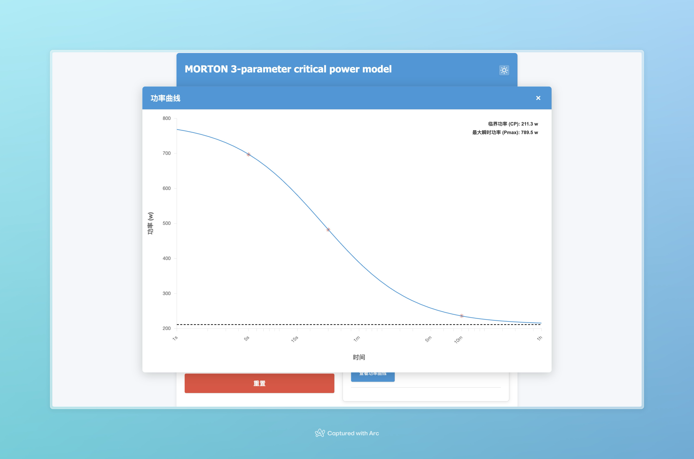

# Power 

## 模型介绍

### A 3-parameter critical power model

- **临界功率 (CP)**：代表运动员可以持续长时间的功率输出极限。
- **无氧储备 (Anaerobic Reserve, W')**：在高于 CP 时，运动员能额外输出的能量储备（焦耳）。
- **时间常数 (Tau)**：模型参数，用于调节功率与时间的关系。
- **Pmax**：模型预测的最大瞬时功率，计算公式：Pmax = CP + W'/Tau。

### VO2Max
Five-Minute Power-Based Test to Predict Maximal Oxygen Consumption in Road Cycling

`VO2max = 16.6 + (8.87 × 5 min relative power output)`

## 前端展示

## 如何运行

- 启动服务：执行 `go run ./...`，服务默认监听在 `:8080` 端口。
- 输入数据得到预测结果